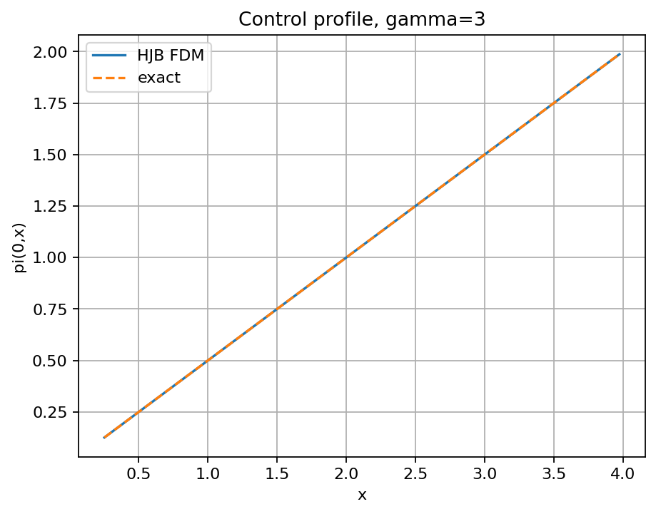
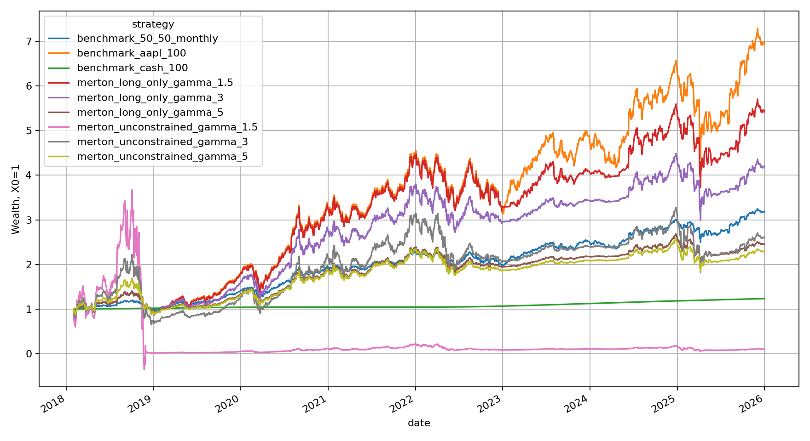
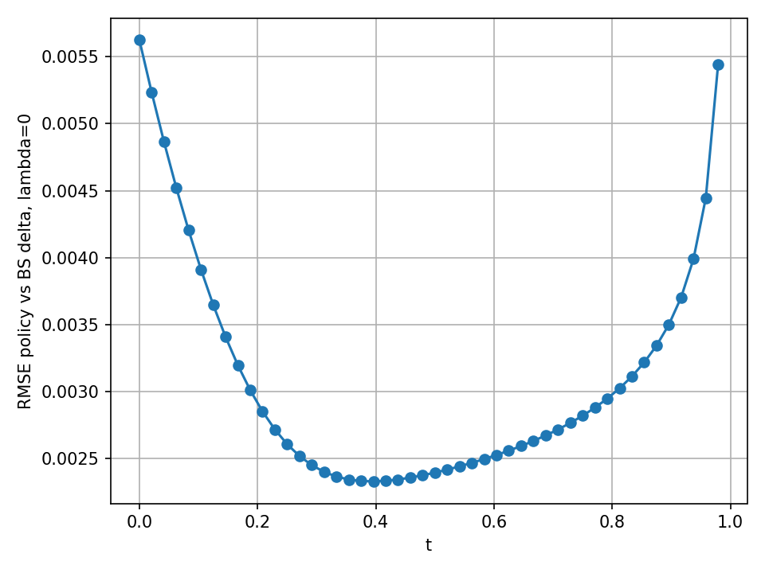
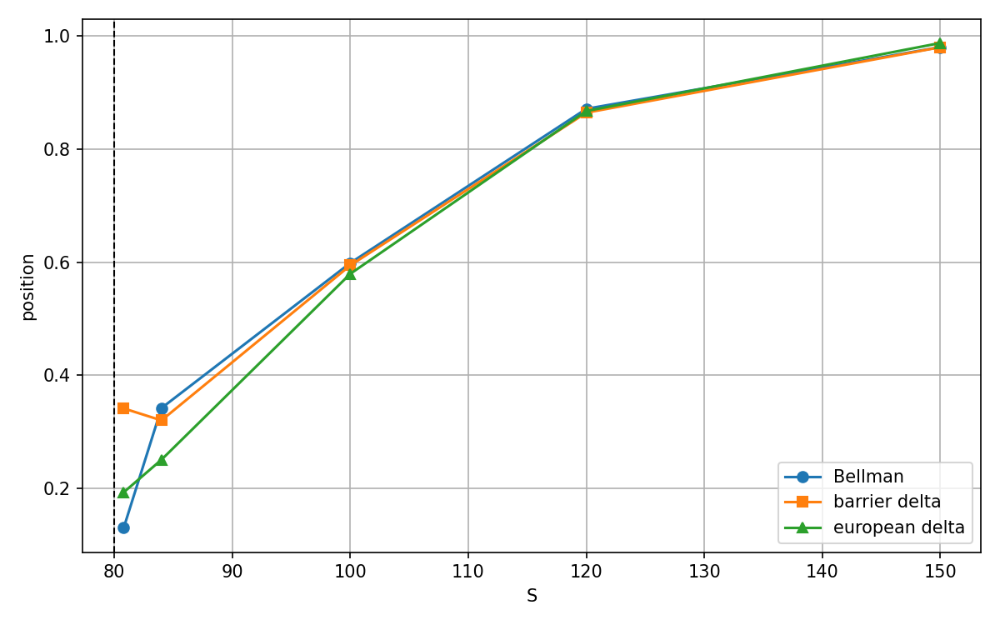

# Stochastic Control in Finance: Dynamic Programming, HJB and Optimal Hedging

This project studies numerical applications of stochastic control in finance, from the classical Merton portfolio problem to dynamic hedging of European and barrier options. It combines analytical benchmarks, Hamilton--Jacobi--Bellman (HJB) equations, finite-difference schemes, discrete-time Bellman recursion, Monte Carlo backtesting, and empirical parameter estimation.

The emphasis is on numerical verification: policies are compared with closed-form or independently computed benchmarks when these are available, convergence diagnostics are reported, and computationally difficult multidimensional branches are identified explicitly as exploratory.

## Main Topics

- Stochastic control and dynamic programming
- Hamilton--Jacobi--Bellman equations
- Merton portfolio allocation under CRRA utility
- Finite-difference methods in log-wealth
- Bellman dynamic programming for quadratic hedging
- Black--Scholes delta hedging as an out-of-sample benchmark
- Proportional transaction costs and no-trade regions
- Down-and-out barrier options and path dependence
- Brownian-bridge correction for between-date barrier crossings
- Walk-forward empirical backtesting on AAPL

## Experiments

### Experiment 1 — Merton Portfolio Problem and HJB

The first experiment considers optimal allocation between one risky asset and a risk-free account for an investor with CRRA utility

$$
U(x)=\frac{x^{1-\gamma}}{1-\gamma}.
$$

The analytical Merton solution provides both the value function and the optimal risky allocation. The corresponding nonlinear HJB equation is transformed to log-wealth and solved backward with finite differences. Numerical derivatives of the value function are then used to reconstruct the optimal control.

This branch is **validated** against the analytical solution. With \(N_x=401\) and \(N_t=1600\), the interior control RMSE is \(1.12\times10^{-5}\), \(1.79\times10^{-4}\), and \(5.15\times10^{-4}\) for risk aversion \(\gamma=1.5,3,5\), respectively. The final profiles contain no detected concavity violations or denominator clipping.



### Experiment 2 — Empirical Merton Strategy on AAPL

The analytical allocation rule is next evaluated with parameters estimated from historical data. At each monthly decision date, annualized drift and volatility are estimated from the strictly preceding 504 daily log returns; the risk-free rate is based on the DGS3MO series. No future observations enter the estimates.

Unconstrained and long-only Merton allocations for several values of \(\gamma\) are compared with 100% AAPL, cash, and a monthly rebalanced 50/50 portfolio. The backtest runs from 1 February 2018 to 31 December 2025 and contains 95 monthly decisions.

The experiment highlights the sensitivity of plug-in Merton allocations to drift estimation and leverage. For example, the unconstrained \(\gamma=1.5\) strategy has an average AAPL exposure of 2.30 and extremely unstable realized weights, whereas the corresponding long-only strategy is bounded by construction. Over this sample, 100% AAPL has the highest terminal wealth, while the preferred strategy under a certainty-equivalent criterion depends on risk aversion.

The main conclusion is that theoretical optimality under known parameters does not guarantee empirical superiority when those parameters must be estimated.



### Experiment 3 — Optimal Hedging with Transaction Costs

This experiment studies terminal quadratic hedging of a European call under exact GBM simulation. The baseline is discrete Black--Scholes delta hedging. Proportional transaction costs take the form

$$
C_n=\lambda S_n\lvert a_n-q_n\rvert,
$$

where \(q_n\) is the position before trading and \(a_n\) is the new position.

The experiment has two complementary parts:

- **Heuristic benchmark (3A):** delta hedging is combined with a no-trade band and tested across trading frequencies and cost levels. Without costs, delta-hedging RMSE decreases from 1.945 at 12 rebalances to 0.436 at 252 rebalances. With costs, an intermediate frequency and a nonzero no-trade band can improve the practical error/cost score.
- **Bellman control (3B):** the objective is \(\mathbb{E}[(W_T-H)^2]\). For \(\lambda=0\), a quadratic value-function representation eliminates the wealth dimension and permits continuous control recovery. For \(\lambda>0\), the state remains \((S,b,q)\), and transaction costs are deducted directly from cash.

The central validation result is

$$
\operatorname{RMSE}(q_{\mathrm{Bellman}},\Delta_{\mathrm{BS}})=0.003105831
$$

on the interior of the state grid for the selected no-cost configuration. Thus, Bellman dynamic programming recovers the Black--Scholes delta to high accuracy **without using that delta during optimization**.

With transaction costs, BUY/HOLD/SELL regions emerge endogenously, and the measured HOLD width increases with \(\lambda\). This multidimensional branch is more difficult numerically: interpolation in cash, time resolution, and the curse of dimensionality materially affect terminal RMSE. Its qualitative policy structure is informative, but its cost-inclusive performance should not be interpreted as a fully converged optimal benchmark.



### Experiment 4 — Down-and-Out Barrier Option Hedging

A down-and-out call introduces path dependence because the liability disappears after the underlying crosses the barrier. An alive/survival indicator is added to the state, making the discretized control problem Markovian. A Brownian-bridge survival probability accounts for crossings between two consecutive observation dates, both in Bellman transitions and in Monte Carlo backtests.

The crossing diagnostic gives:

| Monitoring rule | Knock-out rate |
|---|---:|
| Discrete endpoints | 17.30% |
| Brownian-bridge corrected | 18.55% |

The policy adapts sharply near the barrier. At \(S=80.8\), with barrier \(B=80\), the estimated next-step knock-out probability is 88.8%. The numerical barrier delta is approximately 0.342, while Bellman reduces the stock position to approximately 0.130. At \(S=100\), away from the barrier, the Bellman position returns close to the barrier delta: 0.598 versus 0.594.

This illustrates dynamic adaptation to the risk that the liability disappears. The no-cost barrier branch shows stable refinement and competitive hedging errors; the transaction-cost extension in \((S,b,q,I)\) remains exploratory.



## Numerical Methods

- Explicit finite differences for the transformed Merton HJB equation
- Backward dynamic programming on discrete time grids
- Exact quadratic value-function reductions when transaction costs are absent
- Explicit multidimensional state grids when proportional costs prevent that reduction
- Gauss--Hermite quadrature for conditional expectations
- Linear and non-uniform-grid interpolation with boundary diagnostics
- Monte Carlo simulation with fixed seeds and common paths for comparisons
- Brownian-bridge survival probabilities for continuously monitored barriers
- Spatial, temporal, quadrature, state-grid, action-grid, and interpolation convergence studies

## Repository Structure

```text
.
├── exp_hjb_merton_1d.py              # Experiment 1: HJB solver and Merton validation
├── exp_merton_aapl_empirical.py      # Experiment 2: walk-forward AAPL allocation
├── exp_hedging_transaction_costs.py  # Experiment 3A: delta and no-trade benchmarks
├── exp_hedging_bellman.py            # Experiment 3B: European-call Bellman hedging
├── exp_barrier_hedging_bellman.py    # Experiment 4: down-and-out call hedging
├── src/
│   ├── hjb_fdm.py                    # Finite-difference HJB implementation
│   └── merton_closed_form.py         # Analytical Merton solution
├── tests/
│   └── test_core.py                  # Numerical, financial, and reproducibility tests
├── results/                          # Full experiment outputs, diagnostics, and figures
├── final_report_materials/
│   ├── configs/                      # Archived experiment configurations and summaries
│   ├── figures/                      # Figures selected for the scientific report
│   ├── tables/                       # Consolidated numerical tables
│   └── *.md                          # Methods, equations, sources, results, and limitations
├── report/
│   └── rapport_stage_control_sto.pdf # Full scientific report
└── requirements.txt
```

## Selected Results

| Result | Value | Status |
|---|---:|---|
| Merton HJB interior control RMSE, \(\gamma=3\) | \(1.79\times10^{-4}\) | Validated against closed form |
| Bellman policy RMSE versus BS delta, \(\lambda=0\) | 0.003106 | Validated |
| Barrier Bellman RMSE, \(\lambda=0\), 24 rebalances | 1.352 | Numerically supported no-cost result |
| Barrier-delta RMSE on the same backtest | 1.395 | Benchmark |
| Brownian-bridge minus endpoint KO rate | 1.25 percentage points | Diagnostic |

Detailed tables and the scientific status of each branch are available in [`final_report_materials/key_results.md`](final_report_materials/key_results.md) and [`final_report_materials/limitations.md`](final_report_materials/limitations.md).

## Reproducibility

The project was run with Python 3.11. Install the required third-party packages with:

```bash
python -m pip install -r requirements.txt
```

Run the experiments from the repository root:

```bash
python exp_hjb_merton_1d.py
python exp_merton_aapl_empirical.py
python exp_hedging_transaction_costs.py
python exp_hedging_bellman.py
python exp_barrier_hedging_bellman.py
```

Run the core test suite with:

```bash
python tests/test_core.py
```

The experiment scripts write CSV, JSON, and PNG outputs under `results/`. Simulation seeds and numerical configurations are stored with the results. The AAPL experiment reuses its local raw-data snapshots when present; obtaining fresh market data requires network access. SciPy is optional: when unavailable, the European hedging code uses its implemented normal-CDF fallback.

## Scientific Report

[Read the full scientific report](report/rapport_stage_control_sto.pdf)

The report is written in French. Its supporting tables, figures, equations, methodology, and limitations are collected in [`final_report_materials/`](final_report_materials/).

## Data Sources

Only Experiment 2 uses external market data:

- AAPL daily adjusted prices from the Yahoo Finance chart endpoint, archived in `results/merton_aapl_empirical/data/raw/aapl_yahoo_chart_raw.json`.
- The three-month Treasury constant-maturity rate (DGS3MO equivalent) from the Federal Reserve H.15 data, archived in `results/merton_aapl_empirical/data/raw/federal_reserve_h15_treasury_constant_maturities_raw.csv`.

The rate is converted from an annual percentage to an annual decimal rate and then to a daily simple return; missing daily observations are forward-filled. Experiments 1, 3, and 4 use generated model data rather than external datasets. See [`final_report_materials/data_sources.md`](final_report_materials/data_sources.md) for the exact local files and reproduction notes.

## Limitations

- Drift estimation is noisy and can dominate empirical Merton allocations.
- The simulation experiments assume geometric Brownian motion with constant volatility.
- Transaction costs are proportional and omit market impact, bid--ask dynamics, liquidity constraints, and stochastic volatility.
- Explicit dynamic programming in \((S,b,q)\), or \((S,b,q,I)\) for the barrier contract, suffers from the curse of dimensionality.
- Interpolation and boundary treatment can materially affect multidimensional Bellman policies.
- The European and barrier transaction-cost branches demonstrate economically meaningful no-trade behavior but are exploratory rather than fully converged quantitative solutions.

## Author

Ahmed El Lamrhari  
Engineering Student — École Centrale de Lyon

Research project supervised by Sanjukta Das.
